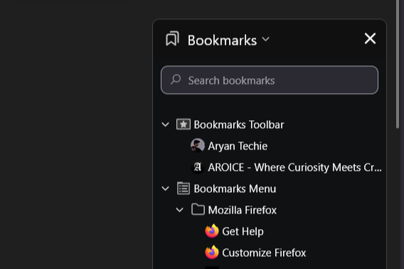

# Zen-floating-bookmarks

Floating style for the Zen Browser bookmarks sidebar.

It makes the bookmarks panel:
- detached from normal layout flow,
- theme-aware (uses Zen color variables),
- animated in/out,
- placeable on either left or right side with a mod preference.

## How this mod works

This mod is a pure CSS Zen Mod made of:

- `userChrome.css`: Applies styles to Firefox/Zen UI elements.
- `preferences.json`: Declares user-facing preferences in Zen Mods settings.

### Core selectors

- `#sidebar-box[sidebarcommand="viewBookmarksSidebar"]`
	Targets the bookmarks sidebar container specifically.
- `window#bookmarksPanel`
	Targets the inner bookmarks sidebar document.
- `search-textbox#search-box[data-l10n-id="places-bookmarks-search"]`
	Styles the bookmarks search input.

### Position preference wiring

In `preferences.json`, `theme.floating_bookmarks.position` is a dropdown (`right` or `left`).
Zen exposes this preference to CSS via attributes on a root theme element.

In `userChrome.css`, these selectors react to that value:

- `:root:has(#theme-Floating-Bookmarks[theme-floating_bookmarks-position="right"])`
- `:root:has(#theme-Floating-Bookmarks[theme-floating_bookmarks-position="left"])`

Those selectors set CSS variables used by the floating panel transform and side offset.
